# Phronesis Product Specification (MVP)

> **Documentation:**
> - [README.md](./README.md): Project overview, setup, and key links
> - [WORKFLOWS.md](./WORKFLOWS.md): CI/CD, automation, and deployment details
> - [TESTING.md](./TESTING.md): All E2E, unit, and AI-assisted testing protocols

> **Testing Protocols:** For all E2E, unit, and AI-assisted testing standards, see [TESTING.md](./TESTING.md).

## Project Metadata
- GitHub Organization: genai-gurus
- Main Repo: https://github.com/genai-gurus/phronesis
- Azure Resource Prefix: phronesis
- Default Branch: main


## Overview & Vision
Phronesis is a B2C platform for mindful decision-making. It helps users reflect on past decisions, capture insights, and receive tailored decision support based on their values, personality, and circumstances. The platform aims to foster a habit of mindful decision-making, leveraging user-generated data for a feedback flywheel that enables deep personalization and continuous improvement.

## Target Audience
Individuals who fear losing or recently lost their job due to AI automation.

## Tone & Branding
The platform should feel warm and supportive, offering encouragement and empathy throughout the user journey.

## MVP Scope
- Focus on a functional MVP that implements the tasks listed in progress.md.
- Prioritize features that support reflection, journaling, and basic value assessment.

---

## AI-Powered Reflection Prompts

## Future-Self Simulator

## Life Theme

## Auto-Tagging & Categorization (Backend Feature)
- Decision journal entries are auto-tagged with `domain_tags`, `sentiment_tag`, and `keywords` on create/update using an LLM-based service (see backend/README.md).
- All new columns are present in the DB and fully covered by migrations and Pytest.

## Admin Endpoints (Internal Use)
- `/api/v1/admin/migrate`: Triggers Alembic DB migrations in the deployed container (see backend/README.md).
- Protected by `MIGRATE_SECRET`. Only callable by CI/CD.
- Returns stdout, stderr, and return code for full debuggability.

- **Model:**
  - `LifeTheme`: id, user_id, theme_text, created_at, updated_at
  - One active theme per user (history preserved)
- **Endpoints:**
  - `GET /api/v1/life-theme`: Get user's current (latest) life theme
  - `POST /api/v1/life-theme`: Set a new life theme (creates new, does not overwrite previous)
- **Request Example:**
  ```json
  { "theme_text": "Growth through challenge" }
  ```
- **Response Example:**
  ```json
  {
    "id": "...",
    "theme_text": "Growth through challenge",
    "created_at": "2025-04-19T22:00:00Z",
    "updated_at": "2025-04-19T22:00:00Z"
  }
  ```
- **Frontend UX:**
  - `/life-theme` page or dashboard card
  - Show current theme and last updated date
  - Edit/add theme with confirmation before overwrite
  - (Optional) AI suggestions for new themes
- **Testing:**
  - Backend: Pytest for expected, edge, and failure cases
  - Frontend: Vitest + RTL for UI/UX


- **Backend Endpoint:** `POST /api/v1/future-self/simulate`
- **Purpose:** Simulate a user's likely future self based on a decision context, values, and optional time horizon. Uses OpenAI GPT-4.1-nano if configured, with robust fallback logic if not.
- **Request Example:**
  ```json
  {
    "decision_context": "Should I move to a new city for a job opportunity?",
    "values": ["growth", "security"],
    "time_horizon": "2 years"
  }
  ```
- **Response Example:**
  ```json
  {
    "future_projection": "In two years, after moving to the new city, you have grown professionally and expanded your network. The transition was challenging at first, but you adapted and found new sources of security and fulfillment.",
    "suggestions": [
      "Research neighborhoods and cost of living.",
      "Connect with local professional groups before moving.",
      "Reflect on what you need to feel secure during transitions."
    ],
    "ai_generated": true
  }
  ```
- **Frontend:** `/future-self` page
  - Modern Material UI form for context, values, and time horizon
  - Calls backend, displays AI projection and suggestions
  - Handles loading, error, and empty states
  - Fully tested with Vitest (expected, edge, failure cases)
- **Testing:**
  - Backend: Pytest with OpenAI mocked for both AI and fallback
  - Frontend: Vitest + RTL for all UI/UX logic
- **Docs:** See backend/README.md for API and environment details


- **Endpoint:** `POST /api/v1/reflection/prompts/generate`
- **Purpose:** Generate personalized reflection prompts for a decision journal entry using OpenAI GPT-4.1-nano (if `OPENAI_API_KEY` is set).
- **Request:**
  ```json
  {
    "entry_id": "<journal_entry_uuid>"
  }
  ```
- **Response:**
  ```json
  {
    "prompts": [
      "Why did you make this decision?",
      "What values did it touch?",
      "How do you feel now?"
    ],
    "ai_generated": true
  }
  ```
- **Fallback:** If `OPENAI_API_KEY` is not set or API call fails, static prompts are returned.
- **Security:** Requires authentication (JWT Bearer token).
- **Environment Variable:**
  - `OPENAI_API_KEY` (required for AI prompts)

## CI/CD & Testing (Current)
- **Workflows:** See [WORKFLOWS.md](./WORKFLOWS.md) for all pipeline details, triggers, and deployment steps.
- **Testing:**
  - Unit tests: Pytest (backend), Vitest (frontend)
  - E2E tests: Playwright (frontend, full user journeys)
  - AI-assisted/manual review: See [TESTING.md](./TESTING.md) for QA protocol
  - All test output is visible in CI logs for auditability
  - Test DB is reset before every CI run
- **Secrets:** All secrets (e.g., `OPENAI_API_KEY`, `MIGRATE_SECRET`) are managed via GitHub Actions secrets or .env files (never committed)
- **Contributor Guidance:**
  - Contributors must ensure all tests pass and code is formatted before merging
  - See [TESTING.md](./TESTING.md) for detailed QA and test procedures

- **Troubleshooting:**
  - If backend tests fail with import errors, check `PYTHONPATH=.` and module locations.
  - If frontend build fails, ensure `index.html` is present and all relevant files are committed.
  - If Black fails, run `poetry run black app tests` and commit.
- See README.md files for more troubleshooting and pipeline details.

---

## Backend Deployment to Azure App Service (Docker, GHCR)

### Overview
The backend is deployed to Azure App Service using a custom Docker image, which is built and pushed to GitHub Container Registry (GHCR) via GitHub Actions. This process ensures secure, production-grade deployment with best practices for secret management and image hygiene.

### Prerequisites
- **Azure App Service** instance created (Linux, Docker).
- **GitHub Container Registry (GHCR)** used for storing production images (see workflow).
- Required secrets set in Azure App Service Configuration:
  - `DATABASE_URL`
  - `OPENAI_API_KEY`
  - Any other environment variables needed for production.

### Deployment & Migration (Current)
1. **Build and Push Docker Image**
   - The GitHub Actions workflow ([.github/workflows/azure-backend.yml](.github/workflows/azure-backend.yml)) builds the Docker image and pushes it to GHCR at `ghcr.io/genai-gurus/phronesis/phronesis-backend:<sha>`.
   - The Dockerfile uses Poetry for dependency management and installs all production dependencies.

2. **Run Database Migrations (Production/Staging)**
   - Migrations are triggered via the protected `/api/v1/admin/migrate` endpoint, called by the "Manual DB Migration" GitHub Actions workflow.
   - The endpoint is protected with a strong secret (`MIGRATE_SECRET`), set both in Azure App Service and as a GitHub Actions secret.
   - The workflow POSTs to the endpoint, which runs `poetry run alembic upgrade head` in the deployed container and returns full output for CI/CD logs.
   - See [WORKFLOWS.md](WORKFLOWS.md) for step-by-step usage and security details.
   - **Note:** Manual/SSH/Kudu-based migrations are deprecated. All production migrations must go through the admin endpoint and workflow for auditability and safety.
5. **Run Database Migrations**
   - After deployment, run Alembic migrations on your production database:
     ```sh
     poetry run alembic upgrade head
     ```

6. **Test the Deployment**
   - Access the app at `https://phronesis-backend-app.azurewebsites.net`.
   - Optionally, test `/docs` or `/health` endpoints for confirmation.

### Security Best Practices
- **No secrets in Docker images:** All secrets are injected at runtime via environment variables.
- **.dockerignore:** Ensures sensitive files are never included in the build context.
- **Public images:** If publishing images publicly on GHCR, ensure no secrets or sensitive files are present in the image.

### Troubleshooting
- **Container fails to start with `gunicorn: executable file not found`:**
  - Ensure `gunicorn` is in production dependencies, not just dev.
  - Run `poetry lock` and redeploy.
- **Application Error page on Azure:**
  - Check Azure Log Stream for startup errors.
  - Confirm all required environment variables are set.
  - Test the image locally with:
    ```sh
    docker run -e OPENAI_API_KEY=yourkey -e DATABASE_URL=yourdb -p 8000:8000 ghcr.io/genai-gurus/phronesis/phronesis-backend:<sha>
    ```
- **CI/CD Fails:**
  - Ensure all tests pass and code is formatted.
  - Check that all dependencies are included in `pyproject.toml` and locked.

### References
- See [backend/README.md](backend/README.md) for detailed backend and Docker instructions.
- See Azure App Service [official docs](https://learn.microsoft.com/en-us/azure/app-service/quickstart-custom-container?tabs=python&pivots=container-linux).

---

## Frontend Authentication & Validation (as of 2025-04-16)

## Tension Detector Logic
- Backend service for detecting "tension" in user value check-ins.
- Flags:
  - Value conflicts (e.g., high scores for values that are often in tension, such as Courage vs. Caution).
  - Rapid swings in a value over time (change of 5+ points between check-ins).
- Used for analytics, user feedback, and future AI guidance.
- Fully unit tested (expected, edge, failure cases).

## Decision Support Chat API
- **Endpoint:** `POST /api/v1/decision-support/chat`
- **Request:**
  ```json
  {
    "messages": [
      { "role": "user", "content": "I'm struggling with a big decision." }
    ],
    "context": "optional context or metadata"
  }
  ```
- **Response:**
  ```json
  {
    "reply": "AI: I see you said 'I'm struggling with a big decision.'. How can I help you think this through?",
    "suggestions": ["Clarify your goals", "Consider possible outcomes", "Reflect on your values"]
  }
  ```
- **Behavior:**
  - Last message must be from the user; otherwise, returns 400.
  - Returns a mock AI reply and suggestions for now (OpenAI integration can be added later).
- **Tests:** Fully unit tested (expected, edge, failure cases).

- Registration and Login UI implemented with React, Vite, TypeScript, and Material UI.
- All client-side validation, error handling, and backend integration are complete.
- All authentication-related frontend tests pass.
- Note: Browser-native validation (`required` attribute) is disabled in test mode to ensure custom validation is exercised and testable in React Testing Library.

## Implemented Backend APIs (as of 2025-04-15)
- User Registration: `POST /api/v1/register`
- Authentication: `POST /api/v1/auth/login` (JWT-based)
- User Profile: `GET /api/v1/profile`, `PUT /api/v1/profile`
- **Decision Chat Sessions & Messages:**
  - `POST /api/v1/decisions/sessions` — Create a DecisionChatSession (requires JWT)
    - Request: `{ "title": string }`
    - Response: `{ "id": UUID, "title": string, "started_at": datetime, ... }`
  - `GET /api/v1/decisions/sessions` — List sessions for current user
  - `POST /api/v1/decisions/sessions/{session_id}/messages` — Create a message in a session
    - Request: `{ "content": string, "sender": "user"|"ai" }`
    - Response: `{ "id": UUID, "session_id": UUID, "sender": string, "content": string, ... }`
  - `GET /api/v1/decisions/sessions/{session_id}/messages` — List messages for a session
  - `PATCH /api/v1/decisions/sessions/{session_id}` — Update session status/summary/insights
  - All endpoints return 401 if not authenticated, 404 if not found, and 422 for validation errors.
- All endpoints are covered by Pytest unit tests (expected, edge, and failure cases) in `/backend/tests/app/api/v1/endpoints/test_decisions.py`.

## Personalization
- Start with a basic value assessment for each user during onboarding.

---

## Auto Tagging and Categorization for Journal Entries

### Purpose
Automatically assign relevant tags and categories to each decision journal entry, improving search, analytics, and personalized insights for users.

### Scope
- **Domain tags**: List of relevant domains (e.g., career, health, relationships, finance, personal growth)
- **Sentiment tag**: One of "positive", "neutral", or "negative"
- **Keywords**: List of 3–7 keywords summarizing the entry

### Implementation: OpenAI LLM-based Tagging

#### Overview
- All auto-tagging is performed by calling the OpenAI API (GPT-4.1-nano).
- The backend sends the journal entry’s title and context to the LLM with a structured function-calling request.
- The LLM is instructed to return a JSON object with:
  - `domain_tags` (list of strings)
  - `sentiment_tag` (string)
  - `keywords` (list of strings)
- If the OpenAI API key is not configured, the endpoint will return a 503 error or a clear fallback response.

#### OpenAI Function Calling (Recommended)
- The backend uses OpenAI’s function calling feature to guarantee the response format.
- The function schema is:
  ```json
  {
    "name": "auto_tag_journal_entry",
    "description": "Auto-tag a decision journal entry with domains, sentiment, and keywords.",
    "parameters": {
      "type": "object",
      "properties": {
        "domain_tags": {
          "type": "array",
          "items": {"type": "string"},
          "description": "Relevant domains (e.g., career, health, relationships, finance, personal_growth)"
        },
        "sentiment_tag": {
          "type": "string",
          "enum": ["positive", "neutral", "negative"],
          "description": "Overall sentiment of the entry"
        },
        "keywords": {
          "type": "array",
          "items": {"type": "string"},
          "description": "Key topics or concepts from the entry"
        }
      },
      "required": ["domain_tags", "sentiment_tag", "keywords"]
    }
  }
  ```
- The backend parses the returned function call arguments and stores them in the database.

#### Example Prompt
> "Given the following decision journal entry, extract the most relevant domains (career, health, relationships, finance, personal growth), sentiment (positive/neutral/negative), and 3-7 keywords. Respond in the specified JSON format."

#### API/Service Changes
- The `AutoTagger` service is replaced with a new implementation that calls OpenAI and parses the function call result.
- All references to NLTK, TextBlob, and RAKE are removed from the codebase and dependencies.
- Tests are updated to mock OpenAI responses for consistent results in CI/CD.

#### Security & Privacy
- The OpenAI API key is required for tagging.
- Journal entry content is sent to OpenAI; ensure this is documented and disclosed to users.
- If the API key is missing, tagging is unavailable and the API returns a 503 error.

#### Testing
- Unit tests mock the OpenAI API and validate that the backend correctly parses and stores tags.
- Tests cover expected, edge, and failure cases (e.g., API errors, malformed responses).

#### Extensibility
- The tagging schema and prompt can be easily updated for new domains or output fields.
- The implementation can be switched to another LLM provider with minimal changes.

---

## Competitive Edge
- No specific competitors or benchmarks targeted at this stage; focus on unique positioning through user-centric design and empathetic support.

## Architecture Design (MVP)

### High-Level Component Diagram
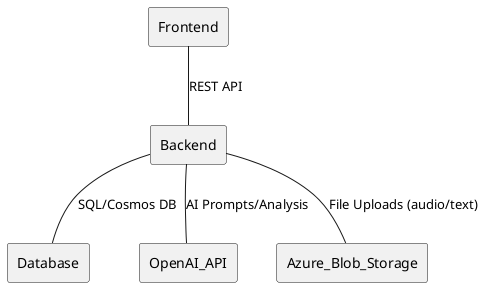

### API Layer Diagram
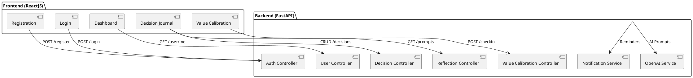

### Entity Relationship Diagram (ERD)
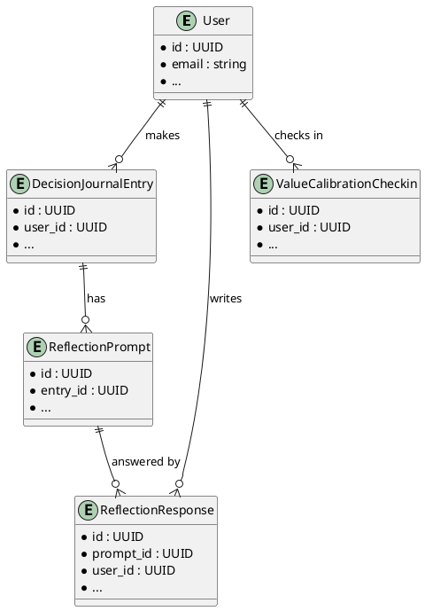

### Authentication & Authorization Flow
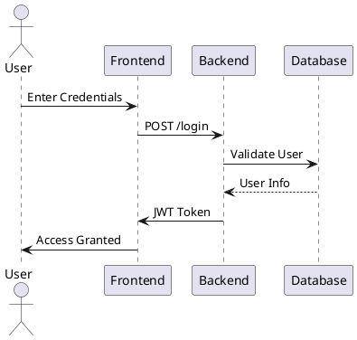

### Notification Flow
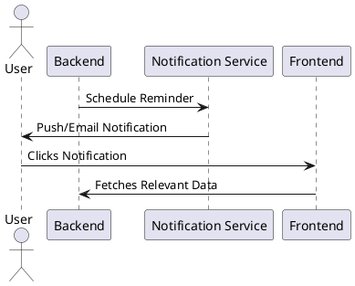

### Data Flow Diagram (Decision Journal Entry)
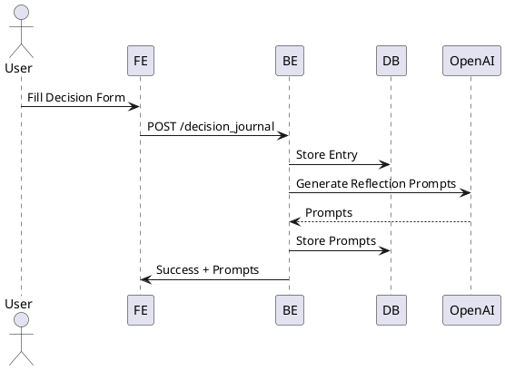

### Sequence Diagram (User Registration)
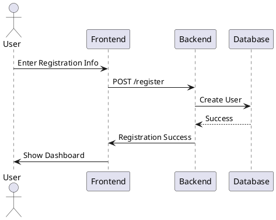

### Technology Stack
- Frontend: ReactJS (PWA, mobile-first)
- Backend: Python (FastAPI preferred for async)
- Database: Azure SQL Database or Azure Cosmos DB
- Cloud: Azure App Service (or Azure Functions for serverless)
- Storage: Azure Blob Storage (for user-generated content)
- AI Integration: OpenAI API (secure key management)
- Monitoring: Azure Application Insights

### Key Architectural Decisions
- RESTful API between frontend and backend
- All user data encrypted in transit and at rest
- Modular backend for easy scaling and future microservices
- PWA for offline-first experience

## User Journey Diagrams

### 1. Decision Logging & Reflection Flow

---

### Value Calibration

#### Backend
- **Endpoints:**
  - `POST /api/v1/value-calibration/checkins` – Create a value calibration check-in (requires auth)
  - `GET /api/v1/value-calibration/checkins` – List all check-ins for the user
- **Schemas:** Pydantic models for request/response, including `value_snapshot` (JSON string of values)
- **Testing:** Pytest unit tests for expected, edge, and failure cases; test DB setup fixture ensures reliable schema

#### Frontend
- **UI:** Modern React + Material UI page with sliders for Courage, Honesty, Curiosity, Empathy, Resilience
- **Features:**
  - User rates each value (1–10)
  - Submits check-in to backend
  - Displays check-in history (with values and timestamps)
  - Robust error/loading/empty states
  - Accessible and responsive design
- **API Integration:**
  - `src/api/valueCalibration.ts` for all API calls
- **Testing:**
  - Comprehensive Vitest + RTL tests
  - Uses `initialValues` prop for robust validation testing (no brittle UI event simulation)
  - Covers success, edge, and failure cases

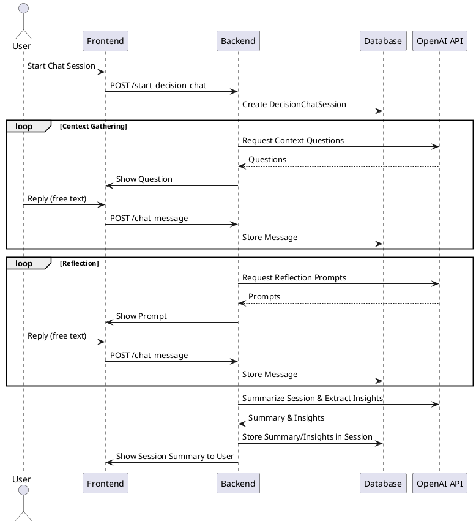

**Note:** At the end of each session, OpenAI is called to summarize the conversation and extract key insights, which are stored in the session for later use (e.g., analytics, progress tracking, personalized prompts).

### 2. Value Calibration Check-in
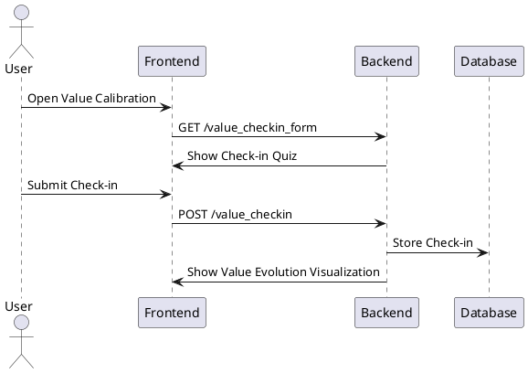

### 3. Decision Support Chat Flow
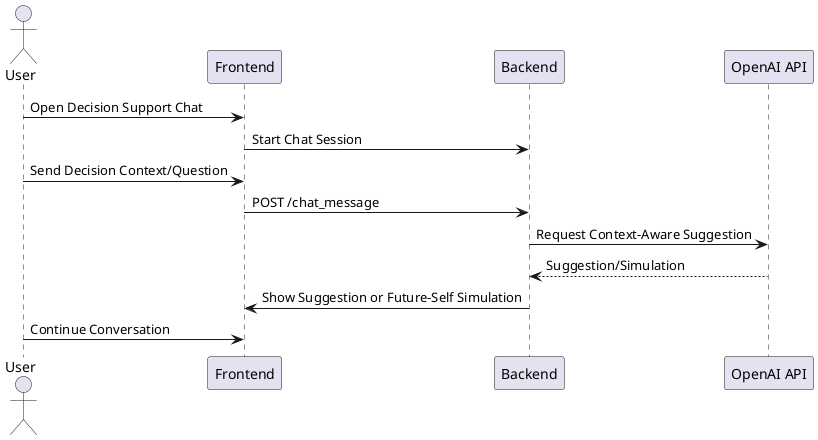

### 4. Gamification & Progress Tracking
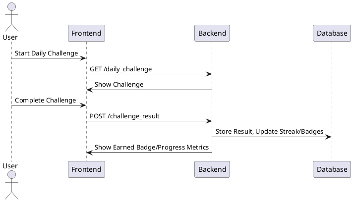

## Key Data Entities (MVP)

### Core Entities

1. **User**
   - id (UUID)
   - email
   - password_hash
   - name
   - demographics (age, gender, location, etc.)
   - values_blueprint (basic value assessment results)
   - registration_date

2. **DecisionChatSession**
   - id (UUID)
   - user_id (foreign key, UUID)
   - title (string, required)
   - started_at (datetime)
   - completed_at (datetime, nullable)
   - status (enum: context_gathering, reflection, completed)
   - summary (text, nullable)
   - insights (text, nullable)

3. **DecisionChatMessage**
   - id (UUID)
   - session_id (foreign key, UUID)
   - sender (enum: user, ai, context, reflection)
   - content (text)
   - created_at (datetime)

4. **DecisionJournalEntry**
   - id (UUID)
   - user_id (foreign key)
   - title
   - context
   - anticipated_outcomes
   - values (list of values touched by decision)
   - domain (auto-tagged: career, health, relationships, etc.)
   - sentiment (auto-analyzed)
   - created_at
   - updated_at

5. **ReflectionPrompt**
   - id (UUID)
   - entry_id (foreign key to DecisionJournalEntry)
   - prompt_text
   - ai_generated (bool)
   - created_at

6. **ReflectionResponse**
   - id (UUID)
   - prompt_id (foreign key)
   - user_id (foreign key)
   - response_text
   - created_at

7. **ValueCalibrationCheckin**
   - id (UUID)
   - user_id (foreign key)
   - checkin_date
   - values_assessment

### Gamification Entities

8. **UserStreak**
   - id (UUID)
   - user_id (foreign key)
   - streak_type (daily, weekly, etc.)
   - current_count
   - last_completed (datetime)

9. **Badge**
   - id (UUID)
   - name
   - description
   - criteria (JSON or text)

10. **UserBadge**
    - id (UUID)
    - user_id (foreign key)
    - badge_id (foreign key)
    - date_awarded

11. **Challenge**
    - id (UUID)
    - name
    - description
    - type (daily, reflection, etc.)
    - start_date
    - end_date

12. **UserChallenge**
    - id (UUID)
    - user_id (foreign key)
    - challenge_id (foreign key)
    - status (pending, completed)
    - date_completed

---
**Note:**
- Decision logging and reflection will be handled through a conversational chat interface. The LLM will ask clarifying/context questions, then transition to reflection prompts. All exchanges are stored as chat messages, with session phases tracked.

1. **User**
   - id (UUID)
   - email
   - password_hash
   - name
   - demographics (age, gender, location, etc.)
   - values_blueprint (basic value assessment results)
   - registration_date

2. **DecisionJournalEntry**
   - id (UUID)
   - user_id (foreign key)
   - title
   - context
   - anticipated_outcomes
   - values (list of values touched by decision)
   - domain (auto-tagged: career, health, relationships, etc.)
   - sentiment (auto-analyzed)
   - created_at
   - updated_at

3. **ReflectionPrompt**
   - id (UUID)
   - entry_id (foreign key to DecisionJournalEntry)
   - prompt_text
   - ai_generated (bool)
   - created_at

4. **ReflectionResponse**
   - id (UUID)
   - prompt_id (foreign key)
   - user_id (foreign key)
   - response_text
   - created_at

5. **ValueCalibrationCheckin**
   - id (UUID)
   - user_id (foreign key)
   - checkin_date
   - values_assessment
