# Phronesis Product Specification (MVP)

## Overview & Vision
Phronesis is a B2C platform for mindful decision-making. It helps users reflect on past decisions, capture insights, and receive tailored decision support based on their values, personality, and circumstances. The platform aims to foster a habit of mindful decision-making, leveraging user-generated data for a feedback flywheel that enables deep personalization and continuous improvement.

## Target Audience
Individuals who fear losing or recently lost their job due to AI automation.

## Tone & Branding
The platform should feel warm and supportive, offering encouragement and empathy throughout the user journey.

## MVP Scope
- Focus on a functional MVP that implements the tasks listed in progress.md.
- Prioritize features that support reflection, journaling, and basic value assessment.

## CI/CD Status & Contributor Guidance (as of 2025-04-16)
- Both backend and frontend CI/CD pipelines (GitHub Actions) are fully passing.
- **Backend pipeline:** Installs with Poetry, checks formatting with Black, and runs all pytest tests with `PYTHONPATH=.`. Contributors must ensure code is formatted and all tests pass before merging.
- **Frontend pipeline:** Installs Node dependencies, lints with ESLint, runs Vitest tests, and builds with Vite. All source files (especially `index.html` and new components/pages) must be tracked by git.
- **Troubleshooting:**
  - If backend tests fail with import errors, check `PYTHONPATH=.` and module locations.
  - If frontend build fails, ensure `index.html` is present and all relevant files are committed.
  - If Black fails, run `poetry run black app tests` and commit.
- See README.md files for more troubleshooting and pipeline details.

## Frontend Authentication & Validation (as of 2025-04-16)

## Tension Detector Logic
- Backend service for detecting "tension" in user value check-ins.
- Flags:
  - Value conflicts (e.g., high scores for values that are often in tension, such as Courage vs. Caution).
  - Rapid swings in a value over time (change of 5+ points between check-ins).
- Used for analytics, user feedback, and future AI guidance.
- Fully unit tested (expected, edge, failure cases).

## Decision Support Chat API
- **Endpoint:** `POST /api/v1/decision-support/chat`
- **Request:**
  ```json
  {
    "messages": [
      { "role": "user", "content": "I'm struggling with a big decision." }
    ],
    "context": "optional context or metadata"
  }
  ```
- **Response:**
  ```json
  {
    "reply": "AI: I see you said 'I'm struggling with a big decision.'. How can I help you think this through?",
    "suggestions": ["Clarify your goals", "Consider possible outcomes", "Reflect on your values"]
  }
  ```
- **Behavior:**
  - Last message must be from the user; otherwise, returns 400.
  - Returns a mock AI reply and suggestions for now (OpenAI integration can be added later).
- **Tests:** Fully unit tested (expected, edge, failure cases).

- Registration and Login UI implemented with React, Vite, TypeScript, and Material UI.
- All client-side validation, error handling, and backend integration are complete.
- All authentication-related frontend tests pass.
- Note: Browser-native validation (`required` attribute) is disabled in test mode to ensure custom validation is exercised and testable in React Testing Library.

## Implemented Backend APIs (as of 2025-04-15)
- User Registration: `POST /api/v1/register`
- Authentication: `POST /api/v1/auth/login` (JWT-based)
- User Profile: `GET /api/v1/profile`, `PUT /api/v1/profile`
- **Decision Chat Sessions & Messages:**
  - `POST /api/v1/decisions/sessions` — Create a DecisionChatSession (requires JWT)
    - Request: `{ "title": string }`
    - Response: `{ "id": UUID, "title": string, "started_at": datetime, ... }`
  - `GET /api/v1/decisions/sessions` — List sessions for current user
  - `POST /api/v1/decisions/sessions/{session_id}/messages` — Create a message in a session
    - Request: `{ "content": string, "sender": "user"|"ai" }`
    - Response: `{ "id": UUID, "session_id": UUID, "sender": string, "content": string, ... }`
  - `GET /api/v1/decisions/sessions/{session_id}/messages` — List messages for a session
  - `PATCH /api/v1/decisions/sessions/{session_id}` — Update session status/summary/insights
  - All endpoints return 401 if not authenticated, 404 if not found, and 422 for validation errors.
- All endpoints are covered by Pytest unit tests (expected, edge, and failure cases) in `/backend/tests/app/api/v1/endpoints/test_decisions.py`.

## Personalization
- Start with a basic value assessment for each user during onboarding.

## Competitive Edge
- No specific competitors or benchmarks targeted at this stage; focus on unique positioning through user-centric design and empathetic support.

## Architecture Design (MVP)

### High-Level Component Diagram
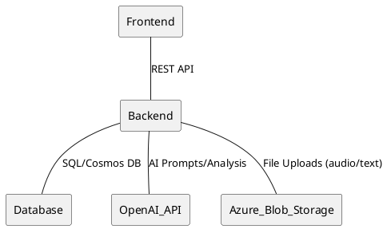

### API Layer Diagram
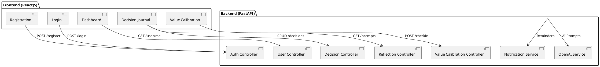

### Entity Relationship Diagram (ERD)
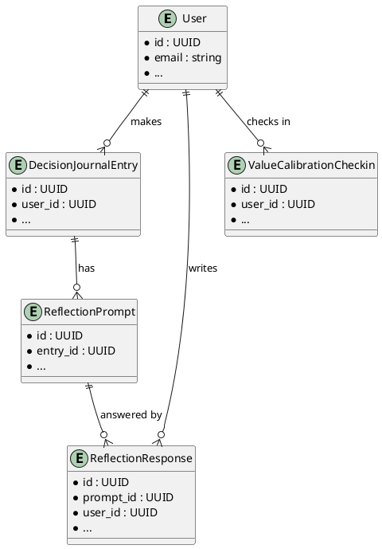

### Authentication & Authorization Flow
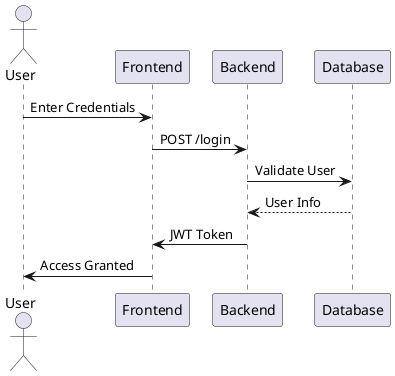

### Notification Flow
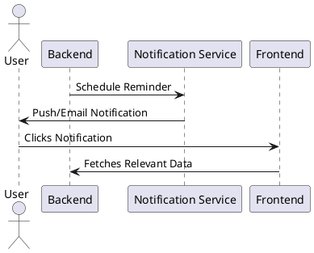

### Data Flow Diagram (Decision Journal Entry)
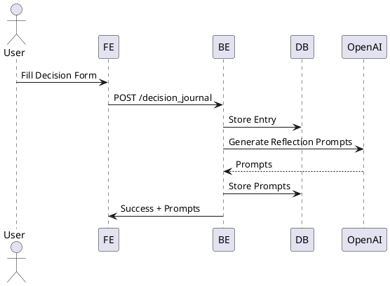

### Sequence Diagram (User Registration)
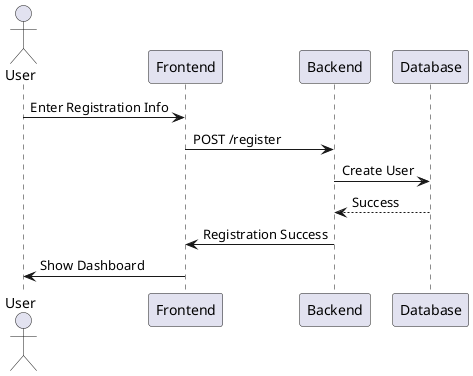

### Technology Stack
- Frontend: ReactJS (PWA, mobile-first)
- Backend: Python (FastAPI preferred for async)
- Database: Azure SQL Database or Azure Cosmos DB
- Cloud: Azure App Service (or Azure Functions for serverless)
- Storage: Azure Blob Storage (for user-generated content)
- AI Integration: OpenAI API (secure key management)
- Monitoring: Azure Application Insights

### Key Architectural Decisions
- RESTful API between frontend and backend
- All user data encrypted in transit and at rest
- Modular backend for easy scaling and future microservices
- PWA for offline-first experience

## User Journey Diagrams

### 1. Decision Logging & Reflection Flow
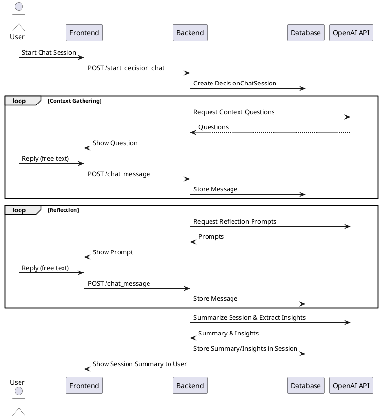

**Note:** At the end of each session, OpenAI is called to summarize the conversation and extract key insights, which are stored in the session for later use (e.g., analytics, progress tracking, personalized prompts).

### 2. Value Calibration Check-in
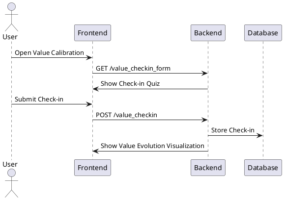

### 3. Decision Support Chat Flow
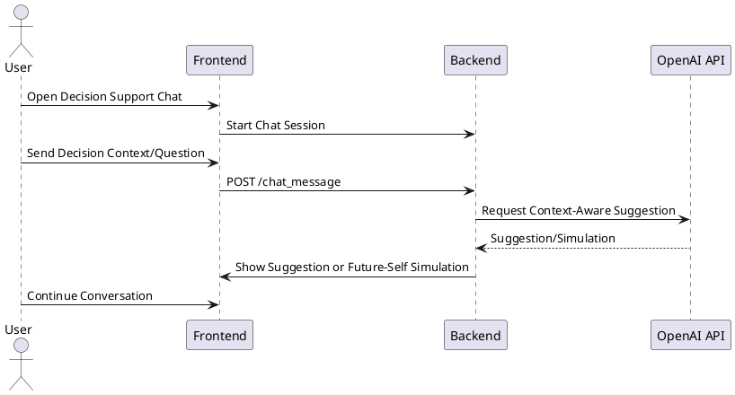

### 4. Gamification & Progress Tracking
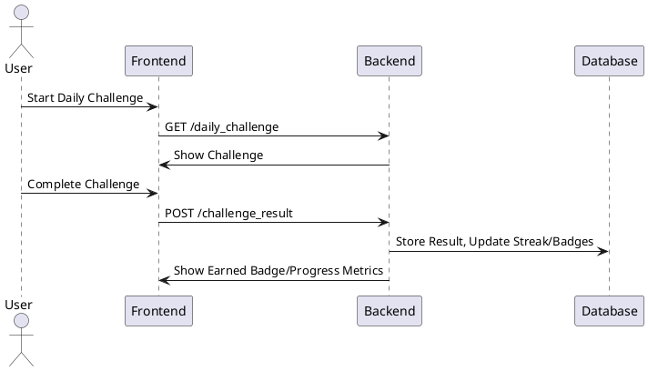

## Key Data Entities (MVP)

### Core Entities

1. **User**
   - id (UUID)
   - email
   - password_hash
   - name
   - demographics (age, gender, location, etc.)
   - values_blueprint (basic value assessment results)
   - registration_date

2. **DecisionChatSession**
   - id (UUID)
   - user_id (foreign key, UUID)
   - title (string, required)
   - started_at (datetime)
   - completed_at (datetime, nullable)
   - status (enum: context_gathering, reflection, completed)
   - summary (text, nullable)
   - insights (text, nullable)

3. **DecisionChatMessage**
   - id (UUID)
   - session_id (foreign key, UUID)
   - sender (enum: user, ai, context, reflection)
   - content (text)
   - created_at (datetime)

4. **DecisionJournalEntry**
   - id (UUID)
   - user_id (foreign key)
   - title
   - context
   - anticipated_outcomes
   - values (list of values touched by decision)
   - domain (auto-tagged: career, health, relationships, etc.)
   - sentiment (auto-analyzed)
   - created_at
   - updated_at

5. **ReflectionPrompt**
   - id (UUID)
   - entry_id (foreign key to DecisionJournalEntry)
   - prompt_text
   - ai_generated (bool)
   - created_at

6. **ReflectionResponse**
   - id (UUID)
   - prompt_id (foreign key)
   - user_id (foreign key)
   - response_text
   - created_at

7. **ValueCalibrationCheckin**
   - id (UUID)
   - user_id (foreign key)
   - checkin_date
   - values_assessment

### Gamification Entities

8. **UserStreak**
   - id (UUID)
   - user_id (foreign key)
   - streak_type (daily, weekly, etc.)
   - current_count
   - last_completed (datetime)

9. **Badge**
   - id (UUID)
   - name
   - description
   - criteria (JSON or text)

10. **UserBadge**
    - id (UUID)
    - user_id (foreign key)
    - badge_id (foreign key)
    - date_awarded

11. **Challenge**
    - id (UUID)
    - name
    - description
    - type (daily, reflection, etc.)
    - start_date
    - end_date

12. **UserChallenge**
    - id (UUID)
    - user_id (foreign key)
    - challenge_id (foreign key)
    - status (pending, completed)
    - date_completed

---
**Note:**
- Decision logging and reflection will be handled through a conversational chat interface. The LLM will ask clarifying/context questions, then transition to reflection prompts. All exchanges are stored as chat messages, with session phases tracked.

1. **User**
   - id (UUID)
   - email
   - password_hash
   - name
   - demographics (age, gender, location, etc.)
   - values_blueprint (basic value assessment results)
   - registration_date

2. **DecisionJournalEntry**
   - id (UUID)
   - user_id (foreign key)
   - title
   - context
   - anticipated_outcomes
   - values (list of values touched by decision)
   - domain (auto-tagged: career, health, relationships, etc.)
   - sentiment (auto-analyzed)
   - created_at
   - updated_at

3. **ReflectionPrompt**
   - id (UUID)
   - entry_id (foreign key to DecisionJournalEntry)
   - prompt_text
   - ai_generated (bool)
   - created_at

4. **ReflectionResponse**
   - id (UUID)
   - prompt_id (foreign key)
   - user_id (foreign key)
   - response_text
   - created_at

5. **ValueCalibrationCheckin**
   - id (UUID)
   - user_id (foreign key)
   - checkin_date
   - values_assessment
